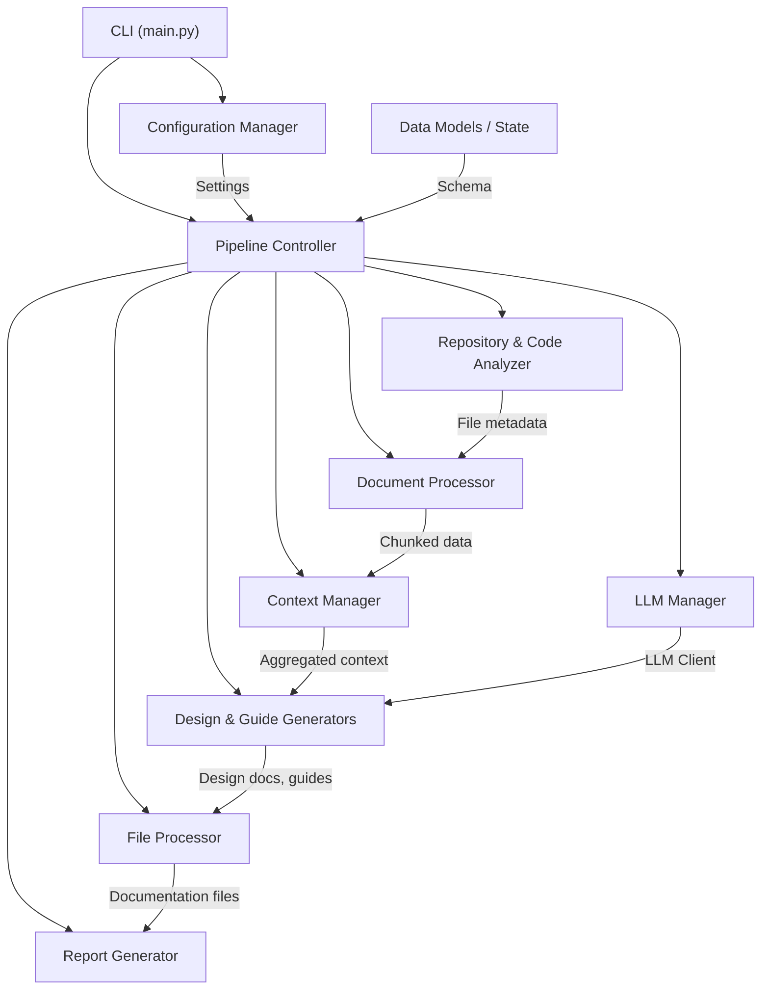

<!-- AUTO-GENERATED DESIGN DOCUMENT -->
<!-- Generated on: 2025-06-11T10:57:06.842589 -->
<!-- Document: architecture -->

# Automated Documentation Generation Toolkit: Architecture Overview

## Introduction

The increasing complexity of modern codebases has made up-to-date documentation more vital—and more challenging—than ever before. The Automated Documentation Generation Toolkit is designed to address this challenge by providing a modular, extensible pipeline that employs advanced code analysis, context management, and large language models (LLMs) to produce high-quality, comprehensive documentation with minimal manual intervention. This document details the architectural foundations of the toolkit, its major components, data flows, design patterns, technology choices, and the interactions that power its functionality.

---

## High-Level System Architecture

At its core, the Automated Documentation Generation Toolkit is organized as a composable, command-line driven pipeline. This architecture ensures each subsystem has a clear and narrowly scoped responsibility, supporting both flexibility and maintainability. The following overview details the primary components and their roles within the system:

### Core System Components

1. **Command-Line Interface (CLI) – `main.py`**
   - Serves as the main user-facing entry point, orchestrating configuration loading and dispatching operations to pipeline components via subcommands.
2. **Configuration Manager – `src/config.py`**
   - Centralizes configuration from YAML and environment files, exposing settings and secrets across the pipeline.
3. **Repository & Code Analyzer – `src/code_analyzer.py`**
   - Discovers, classifies, and aggregates source file metadata for subsequent analysis.
4. **Document Processor – `src/document_processor.py`**
   - Manages the loading, tokenization, chunking, and summarization of code and documentation files.
5. **Context Manager – `src/context_manager.py`**
   - Aggregates and summarizes documentation context to enable effective LLM prompting.
6. **LLM Manager – `src/llm_manager.py`**
   - Abstracts interaction with multiple LLM providers, handling client instantiation and configuration.
7. **Design & Guide Generators – `src/design_document_generator.py`, `src/guide_generator.py`**
   - Generate structured design documents and documentation guides through iterative LLM-powered procedures.
8. **File Processor & Report Generator – `src/file_processor.py`, `src/report_generator.py`**
   - Manages incremental file processing and assembles outputs into detailed summary reports.
9. **Pipeline Controller – `src/pipeline.py`, `src/state_manager.py`**
   - Orchestrates the multi-step workflow, encapsulating stepwise logic and state management.
10. **Supporting Utilities**
    - Provides tokenization, prompt templating, and file access primitives.
11. **Data Models – `src/models.py`**
    - Encapsulates schema definitions for consistent data interchange between components.

#### System Diagram

---

## Data Flow Between Components

The overall workflow is structured as a sequence of tightly integrated stages, ensuring efficient execution with minimal redundancy:

1. **Initialization & Configuration**
   - User interaction with the CLI triggers configuration setup and pipeline initialization.
2. **Repository Analysis**
   - The Code Analyzer inspects project structure, creating a catalog of source files and metadata.
3. **Document Processing**
   - Document Processor loads and prepares documentation and code for further handling, managing tokenization and chunking.
4. **Context Building & Summarization**
   - Context Manager synthesizes all relevant information into an LLM-ready context, summarizing as needed.
5. **LLM-Based Documentation Generation**
   - LLM Manager provisions an appropriate model; design and guide generators prompt the LLM for new documentation.
6. **Incremental File Processing**
   - File Processor selectively generates docs for modified/new files based on content hashes.
7. **Reporting and Output Assembly**
   - Generated outputs are persisted; Report Generator compiles summary reports and indexes.
8. **Pipeline Orchestration**
   - State and intermediate results are tracked throughout by centralized pipeline controllers.

---

## Architectural Patterns

The toolkit’s robustness and adaptability derive from several key architectural patterns:

- **Modular Pipeline:** Each component is independently replaceable and testable.
- **State Machine Controller:** Pipeline progress and branching are governed centrally by a state machine.
- **Adapter Pattern for LLMs:** Uniform interfaces abstract away specifics of each LLM provider.
- **File-Based Incrementality:** Content hashes track file changes, enabling efficient regeneration.
- **Configuration-Driven Execution:** YAML and environment configurations drive behavior, reducing code modifications for new deployments.

---

## Technology Stack Overview

| **Component**            | **Technology**                                                |
|--------------------------|--------------------------------------------------------------|
| Programming Language     | Python 3.x                                                   |
| CLI & Orchestration      | Python argparse                                              |
| LLM Integration          | OpenAI, Anthropic, Azure OpenAI (official SDKs)              |
| Data Modeling            | Pydantic                                                     |
| Data Serialization       | YAML (PyYAML), JSON                                          |
| Env/Secret Management    | python-dotenv                                                |
| Tokenization             | tiktoken (OpenAI), fallback word-based estimation            |
| Markdown Generation      | String handling / markdown libraries                         |
| File Handling            | Python pathlib, os                                           |
| Testing & Extensibility  | Modular, importable components                               |

---

## Component Details

To provide clarity on responsibilities and integration, this section describes each subsystem’s API surface, supported data models, and connections to other modules.

### 1. Command-Line Interface (CLI) – `main.py`

Handles user interaction and dispatches control to the rest of the pipeline. The CLI offers subcommands for generating documentation, analyzing repositories, or validating configurations. Internally, it leverages the Configuration Manager for settings and launches appropriate workflow branches within the pipeline.

### 2. Configuration Manager – `src/config.py`

Serves as the single source of truth for toolkit configuration. It loads and validates settings (YAML, environment), making them accessible via a central API. Downstream consumers—such as the LLM Manager or code analysis stages—rely on this for consistent provider and parameter access.

### 3. Repository & Code Analyzer – `src/code_analyzer.py`

Discovers source files and code structure, producing a normalized list of files and metadata. This data informs which files will be processed, summarized, or skipped in subsequent stages.

### 4. Document Processor – `src/document_processor.py`

Manages the preparation of code and documentation for input into language models. Tokenization, chunking, and automated summarization ensure LLM prompts stay within provider limits, optimizing both cost and output quality.

### 5. Context Manager – `src/context_manager.py`

Aggregates all available content—existing documentation, code, and generated material—into a coherent context for LLM consumption. When documentation exceeds token thresholds, it employs summarization strategies to condense content efficiently.

### 6. LLM Manager – `src/llm_manager.py`

Abstracts specifics of LLM provider APIs, credential resolution, and client instantiation. All generator components interact with LLMs exclusively through this manager, guaranteeing a uniform, provider-agnostic interface.

### 7. Design & Guide Generators  
- **Design Document Generator:** Facilitates section-wise authoring of overarching design documents via LLM, handling retries and coherent assembly.
- **Guide Generator:** Compiles generated documentation into human-friendly guides, summaries, and indexes, ready for project use.

### 8. File Processor – `src/file_processor.py`

Enables efficient incremental documentation through per-file hash tracking, writing, and directory structure management. It avoids redundant regeneration, persisting only modified or new outputs.

### 9. Report Generator – `src/report_generator.py`

Collates reporting outputs—summary statistics, per-file docs, index tables—at the culmination of the pipeline, providing both disk outputs and CLI feedback.

### 10. Pipeline Controller – `src/pipeline.py`, `src/state_manager.py`

Acts as the orchestrator for the entire workflow, managing state, deciding which steps or branches to execute, and ensuring that each stage’s results flow efficiently to the next.

### 11. Supporting Utilities

Include token management, safe file/directory operations, and reusable prompt modules. These ensure smooth functioning around core pipeline logic and maximize reliability.

### 12. Data Models – `src/models.py`

All inter-component data is defined and validated using Pydantic models, providing a well-typed substrate for exchanging configs, results, context, and states throughout the pipeline.

---

## Component Interactions and Data Contracts

The system’s composability depends on strict, schema-driven contracts—primarily realized via Pydantic models—across all major component boundaries. The centralized Configuration Manager ensures coherent setup, while the PipelineState object serves as the backbone for workflow progress and data sharing. This solid foundation enables straightforward extensibility (such as plugging in new LLM providers or file types) by simply extending or adapting Config Manager, LLM Manager, or generator modules without wholesale re-architecture.

---

## Conclusion

The Automated Documentation Generation Toolkit exemplifies robust architectural principles: clear separation of concerns, modular pipeline design, extensibility via data modeling, and resilience to evolving requirements in documentation automation. By integrating state-of-the-art LLMs, token-aware context management, and efficient orchestration, it empowers engineering teams to maintain comprehensive, current, and useful documentation as codebases grow and change. Each subsystem interlocks cleanly to form an end-to-end solution that is both powerful out-of-the-box and readily adaptable to new use cases and technologies.