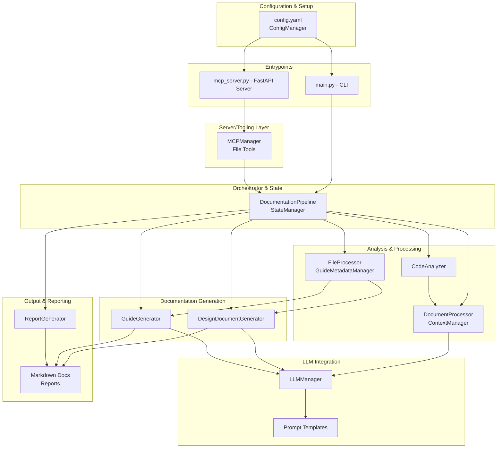

<!-- AUTO-GENERATED DESIGN DOCUMENT -->
<!-- Generated on: 2025-07-01T23:32:28.117312 -->
<!-- Document: architecture -->

# Documentation MCP Server: Architecture Overview and Component Guide

## Introduction

High-quality, up-to-date technical documentation is critical to modern software delivery, yet its creation and maintenance often lag behind rapid code changes. The Documentation MCP Server is a modular, extensible system that uses AI and automation to bridge this gap. Designed for adaptability and robustness, it orchestrates the flow from raw source repositories to polished Markdown artifacts, leveraging state-of-the-art Python libraries and large language models (LLMs). This document provides a comprehensive architectural overview and a detailed breakdown of key system components, guiding both users and maintainers in understanding the MCP Server's structure, workflows, and integration patterns.

---

## System Overview

The Documentation MCP Server operates as a modular automation framework targeting technical documentation generation. Its architecture is designed around principles of maintainability, extensibility, and scalability, making use of powerful LLM technologies and a modern Python ecosystem. The server orchestrates a pipeline that begins with configuration and source code analysis, processes contextual information, generates guides, design docs, and reports—while supporting both command-line and API-based invocations.

### High-Level Architecture

At its core, the architecture breaks down into several focused components:

1. **Configuration Management:** Loads and validates settings (such as LLM provider info, file inclusion rules, output formats) for use across all modules.
2. **Main Orchestrator (Documentation Pipeline):** Coordinates the end-to-end workflow via state machines and event-driven logic, triggered either by CLI tools or server APIs.
3. **Code and Document Analysis:** Examines repositories, splits/loading of documents, and contextualizes content for LLM compatibility.
4. **Documentation Generation:** Produces file-level documentation, guides, and deep design documents, all powered by LLMs and prompt templates.
5. **Metadata and State Management:** Enables incremental builds and efficient change tracking.
6. **LLM Integration and Prompt System:** Abstracts interaction with multiple LLM providers and maintains reusable, parameterized prompt templates.
7. **Server and Tooling Interface:** Exposes API endpoints and tooling-compatible methods for IDEs and CI/CD environments.
8. **Output/Reporting:** Aggregates logs, statistics, and artifacts in Markdown suited for codebase inclusion or external consumption.
9. **Utilities:** Handles token estimation and management, ensuring efficient use of LLM context limits.

#### Data Flow

The journey from raw code to published documentation involves:
1. Loading and validating configuration from `config.yaml`.
2. Repository scanning to determine relevant files.
3. On-the-fly contextualization and chunking of files for LLM consumption.
4. Documentation generation via structured, LLM-powered prompts.
5. Incremental detection of changes for efficient builds.
6. Final output serialization and reporting.
7. Exposing server APIs for on-demand, tool-driven documentation or analysis.

#### Architectural Patterns

- **Pipeline/Workflow Orchestration:** Central state machines for robust sequencing and error recovery.
- **Separation of Concerns:** Distinct modules for each responsibility.
- **Incremental Build Support:** Change detection for efficient regeneration.
- **Plugin-Friendly API Layer:** LangChain tool wrappers and server endpoints for easy integration.
- **Strong Token/Context Management:** Ensuring compatibility with LLM context limits.

---

## Technology Stack Overview

The Documentation MCP Server leverages a modern Python stack and best-in-class machine learning and API frameworks:

- **Programming Language:** Python 3.9+
- **Core Libraries:**
  - [LangChain](https://www.langchain.com/) & [LangGraph](https://github.com/langchain-ai/langgraph) for LLM workflow orchestration
  - [OpenAI](https://platform.openai.com/) & [Anthropic](https://www.anthropic.com/) for LLM backend support
  - [FastAPI](https://fastapi.tiangolo.com/) for API server functionality
  - [Pydantic](https://pydantic.dev/) for data validation and schema
  - [PyYAML](https://pyyaml.org/) for configuration handling
  - [tiktoken](https://github.com/openai/tiktoken) for token management
- **File/Path Handling:** Standard Python libraries
- **Output:** Markdown (documents, guides, reports), JSON/YAML (metadata/state)
- **Developer Integration:** VS Code tasks/settings, extensible prompt templates in `src/prompts`

---

## System Architecture Diagram

The following diagram illustrates the main system components and their relationships:

---

## Component Details

Understanding the specific roles of each major system component is crucial for extensibility and maintenance. The following sections provide a deep dive into their responsibilities, APIs, and integration strategies.

### 1. Configuration Management

Handles all global and module-specific settings, pulling from `config.yaml` and securely handling secrets (e.g., LLM API keys). Exposes validated, central configuration to every system module via the `ConfigManager` class.

**Key APIs:** `load_config()`, `get(key)`, `get_llm_provider_settings()`, property accessors for directories and rules.

**Integration:** Used extensively by the orchestrator, LLM manager, analyzers, and documentation generators.

---

### 2. Main Orchestrator (Documentation Pipeline)

Serves as the control center for running the documentation workflow, whether triggered from the CLI or a server endpoint. The `DocumentationPipeline` and `StateManager` classes govern the process, maintaining state and handling error recovery.

**Key APIs:** `run()`, CLI commands, `advance_state()`, integration with varied entry points (`main.py`, `mcp_server.py`).

**Integration:** Calls into analyzers, processors, generators, and reporters to execute the documentation generation process.

---

### 3. Code and Document Analysis

Responsible for scanning code repositories, identifying documentation targets, and chunking or summarizing larger documents for efficient LLM use. Metadata collection assures contextually aware, efficient processing across the pipeline.

**Key APIs:** `scan_repository()`, `should_include_file()`, `analyze_file_structure()`, `load_document_content()`, and summarization utilities.

**Integration:** Supplies analyzed data to documentation generators; key to incremental and context-aware builds.

---

### 4. Documentation Generation

Encompasses specialized generators for different documentation requirements—design documents, repo-wide guides, and per-file documentation. Relies on LLMs and prompt templates for high-quality, structured outputs.

**Key APIs:** `generate_design_document()`, `generate_documentation_guide()`, `process_file()`, artifact serialization.

**Integration:** Consumes context/document processing outputs, leverages LLMManager, outputs Markdown and metadata for downstream use.

---

### 5. Metadata and State Management

Enables efficient incremental and full builds by tracking what has changed in the codebase and controlling pipeline state transitions. The `GuideMetadataManager` and `StateManager` coordinate this logic, promoting scalability and robust error-handling.

**Key APIs:** `load_metadata()`, `save_metadata()`, `detect_file_changes()`, state advancement methods.

**Integration:** Tightly coupled with orchestrator and documentation generators for dynamic, efficient builds.

---

### 6. LLM Integration and Prompt System

Provides LLM abstraction—masking differences between providers such as OpenAI and Anthropic—and manages system prompt templates for reuse and parameterization. This ensures consistent, high-quality LLM output and easy future extensibility.

**Key APIs:** `get_llm()`, importable prompt templates.

**Integration:** Invoked by all generation components, making LLM use uniform across the platform.

---

### 7. Server and Tooling Layer

Offers a FastAPI server (`mcp_server.py`) and MCPManager responsible for integrating with external tools—such as IDEs, plugins, and CI systems. Tool wrappers and compatible APIs allow agent-driven codebase exploration and analysis.

**Key APIs:** FastAPI endpoints (`/find_relevant_files`, `/understand_feature`), LangChain-compatible Tool methods.

**Integration:** Bridges external tools to the documentation generation pipeline; enables automation in team workflows.

---

### 8. Output and Reporting

Aggregates documentation, run state information, and error logs into Markdown reports or serialized formats. The `ReportGenerator` provides ready-to-share human- and machine-readable summaries of each pipeline execution.

**Key APIs:** `generate_report(state)`

**Integration:** Invoked as the final pipeline step, producing consumable artifacts for developers and automation alike.

---

### 9. Utilities

Focused utilities, such as the `TokenManager`, facilitate context-aware LLM interactions by estimating and budgeting token usage—essential for running reliably against LLM context size limits.

**Key APIs:** `count_tokens()`, `estimate_message_tokens()`

**Integration:** Used by processors and generators to govern text chunking and LLM prompt sizing.

---

### Data Models and Schemas

Robust Pydantic models ensure strong typing, validation, and reliable data interchange for configuration, state, metadata, API requests, and responses. All major artifacts and workflows rely on these schemas, supporting both developer experience and automated tooling.

---

## Integration Summary

The Documentation MCP Server exemplifies modern, maintainable, and extensible architecture. Each module operates with a clear separation of concerns, interoperates through well-typed APIs, and contributes to a coherent, AI-driven documentation workflow. The integration of LLMs, prompt management, and plugin-friendly APIs ensures adaptability to diverse project requirements, IDE/workflow integrations, and evolving future needs.

---

## Conclusion

The Documentation MCP Server stands out by marrying robust Python architecture with LLM-powered documentation workflows, supporting both full and incremental updates. Its modular components, thoughtful state and metadata management, and rich APIs make it a strong foundation for teams seeking to automate, enhance, and scale technical documentation as code evolves. This architecture not only ensures maintainable and high-quality output but also positions the MCP Server for ongoing innovation and seamless integration into developer ecosystems.