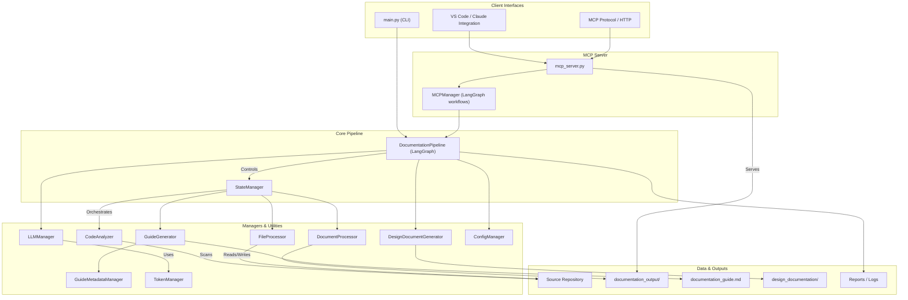

<!-- AUTO-GENERATED DESIGN DOCUMENT -->
<!-- Generated on: 2025-07-01T23:09:44.522669 -->
<!-- Document: architecture -->

# Documentation MCP Server Architecture

## Introduction

Automated, reliable, and up-to-date documentation is a cornerstone of effective software engineering, yet generating and maintaining it at scale is a perennial challenge. The Documentation MCP Server addresses this challenge by orchestrating powerful AI models and extensible automation pipelines to analyze, generate, and present rich documentation artifacts for code repositories. Designed with modularity, extensibility, and security in mind, the system seamlessly integrates with modern developer tools and workflows, providing both human users and AI assistants with deep insight into codebases.

This document presents a comprehensive architecture for the Documentation MCP Server. It begins with a high-level overview of the system and its key patterns, then explores the components and their relationships, provides details on major modules, and summarizes integration points, output mechanisms, and extensible capabilities.

---

## System Overview

### High-Level Architecture

The Documentation MCP Server is architected as a modular, extensible system designed to automate documentation generation, analysis, and exploration for source code repositories. Its architecture blends state-of-the-art AI model orchestration with robust, developer-friendly tooling and secure, configurable components. This section provides a comprehensive overview of the system’s primary components, their interactions, typical data flow, core architectural patterns, and the underlying technology stack.

---

### System Components and Relationships

The solution is composed of several interacting modules, each with clear responsibilities. The following summarizes the key components:

1. **Command-Line Interface (CLI) & Entry Points**  
   Main scripts serve as user entry points for documentation generation, cleanup, analysis, and starting the server API.

2. **MCP Server**  
   Implements service endpoints for natural language interactions with documentation. It coordinates internal managers and handles integration.

3. **Pipeline and Orchestrators**  
   Coordinates overall workflow (via LangGraph), manages state, and orchestrates each documentation run.

4. **Core Managers**  
   Provide modular management of configuration, language model orchestration, and workflow control.

5. **Domain Modules and Utilities**  
   Handle code analysis, intelligent document/file processing, incremental metadata tracking, and guide/design doc generation.

6. **Prompt and Tool Modules**  
   Centralize LLM prompts and provide tools for secure, repo-scoped file operations.

7. **Data Models and State**  
   Strongly-typed Pydantic schemas capture configuration, workflow state, metadata, and results, ensuring reliable operation and clear contracts.

8. **Output and Reporting**  
   Manages the generation of Markdown documentation artifacts, reports, and logs.

---

#### Mermaid System Architecture Diagram



---

### Data Flow Summary

The system follows a well-defined, multi-stage data processing pipeline:

1. **Input & Configuration:**  
   Users interact via CLI commands or MCP API requests. Configuration is loaded and validated.

2. **Repository Analysis:**  
   CodeAnalyzer scans source files and produces metadata needed for downstream processing.

3. **Documentation Orchestration:**  
   DocumentationPipeline, powered by LangGraph and managed state, delegates file processing, triggering LLM-based summaries or documentation generation.

4. **Large Language Model Interaction:**  
   LLMManager instantiates the requested LLM provider; prompts and context are supplied, and text is generated and validated.

5. **Artifact Generation:**  
   Processed outputs are written per file (Markdown), with high-level guides and cohesive design docs generated as needed.

6. **MCP Server & AI Integrations:**  
   The server layer manages AI-powered exploration tools and returns structured results.

7. **Output:**  
   All generated content is saved and exposed for use in developer workflows, with detailed reporting for transparency.

---

### Key Architectural Patterns

- **Workflow Orchestration:**  
  Orchestrates documentation and analysis tasks using stateful, node-based workflows.

- **Manager Pattern:**  
  Encapsulates core tasks (pipeline, config, LLM access, file/document handling) in well-defined managers for modularity and extensibility.

- **Model-Driven Validation:**  
  Employs rich Pydantic models for data integrity, validating all key entities and contracts.

- **Plugin/Extension Readiness:**  
  Modular design supports easy integration of new providers, pipelines, or prompts.

- **Secure File Operations:**  
  File and directory access is strictly controlled and validated for security.

- **Incremental and Idempotent Processing:**  
  Metadata-driven checks allow efficient incremental documentation and cleanup without redundant processing.

---

### Technology Stack Overview

- **Python 3.x:** Main implementation language.
- **LangChain & LangGraph:** Workflow and LLM integration.
- **Pydantic:** Data validation and schema modeling.
- **OpenAI & Anthropic (Claude):** LLM-powered text analysis and generation.
- **tiktoken:** Token counting for LLM operations.
- **YAML:** Human-friendly configuration.
- **Virtualenv/Venv, requirements.txt:** Dependency and environment management.
- **Markdown:** Output format for broad editor compatibility.
- **VS Code Tasks, MCP Protocol:** For IDE/AI/CLI connectivity.
- **Custom Security Utilities:** Restrict all repo operations to safe scopes.

---

### System Summary

The Documentation MCP Server’s architecture combines robust, modular engineering with cutting-edge AI model workflows. Its manager-driven design, strong validation, and seamless IDE integrations enable maintainable, scalable, and incremental documentation across software projects. Through this foundation, both human teams and AI agents are empowered to achieve greater comprehension and maintain the high-quality documentation essential for modern development success.

---

## Component Details

To better understand the system’s robustness and extensibility, this section provides in-depth descriptions of the major components and their roles within the Documentation MCP Server architecture.

---

### 1. Command-Line Entry Points

#### **main.py (CLI Interface)**
- **Responsibilities:** User-facing entry point for orchestrating documentation tasks, including generation, analysis, validation, and cleanup. Parses CLI arguments, configures pipeline, and invokes orchestration layers.
- **Interfaces/Usage:** Command-line arguments via `argparse`; used as:
  ```
  python main.py generate --repo-path /path/to/repo --cleanup
  python main.py analyze --repo-path /path/to/repo
  ```
- **Integration:** Bootstraps configuration via ConfigManager and delegates execution to DocumentationPipeline.

#### **mcp_server.py (MCP Server Entrypoint)**
- **Responsibilities:** Runs the server for API-driven project exploration, exposing endpoints such as `get_relevant_files` and `understand_feature`.
- **Interfaces:** Accepts repo path argument, listens for MCP requests, returns structured results.
- **Integration:** Delegates AI-powered analysis to MCPManager; loads config via ConfigManager.

---

### 2. MCP Server Stack

#### **MCPManager**
- **Responsibilities:** Orchestrates LLM-powered tool requests, manages LangGraph workflows, and coordinates model interactions and contextual analysis.
- **APIs:** Provides functions like `find_relevant_files` and `understand_feature`.
- **Data Models:** Relies on specialized Pydantic schemas for state and result validation.
- **Integration:** Connects with LLMManager, GuideGenerator, and utility modules.

---

### 3. Documentation Pipeline Orchestration

#### **DocumentationPipeline**
- **Responsibilities:** Central orchestrator for all documentation, guide, and design doc generation, managing a LangGraph-driven workflow with explicit state handling.
- **Interfaces:** Invoked programmatically with repository details and pipeline config.
- **Integration:** Coordinates domain-specific modules (CodeAnalyzer, FileProcessor, etc.) via StateManager.

#### **StateManager**
- **Responsibilities:** Manages branching and state transitions based on workflow logic (when to process, skip, summarize, etc.).
- **Interfaces:** Maintains and mutates pipeline state; used by DocumentationPipeline.

---

### 4. Core Managers and Utilities

#### **CodeAnalyzer**
- **Responsibilities:** Scans repositories for relevant code, applying inclusion/exclusion rules, generating file lists and metadata.
- **APIs/Data Models:** Produces lists of CodeFile objects.

#### **FileProcessor**
- **Responsibilities:** Handles secure reading/writing, change detection, hash-based incremental document generation.
- **Integration:** Serves the pipeline by efficiently persisting or updating docs.

#### **DocumentProcessor**
- **Responsibilities:** Loads documentation text, performs chunking and token counting for LLM context constraints.

#### **GuideGenerator & GuideMetadataManager**
- **Responsibilities:** Generates high-level Markdown documentation guides; tracks metadata for incremental updates.

#### **DesignDocumentGenerator**
- **Responsibilities:** Produces cohesive, structured multi-section design docs through iterative LLM prompting and context assembly.

#### **ConfigManager**
- **Responsibilities:** Loads, validates, and provides runtime configuration and credentials.

#### **LLMManager**
- **Responsibilities:** Abstracts language model initialization (OpenAI, Anthropic, Azure), configures models per runtime/environment settings.

#### **ReportGenerator**
- **Responsibilities:** Aggregates and persists reports on process outcomes (success, failure, skips).

---

### 5. Prompt and Tool Modules

#### **Prompt Files**
- **Responsibilities:** Core library for system prompt/message templates, ensuring consistency across LLM-driven workflows.

#### **File Tools**
- **Responsibilities:** Provide secure file/directory access, exposed to LLM agents as LangChain Tool objects for controlled operations.

---

### 6. Data Models and Schemas

#### **Pydantic Core Models**
- **Responsibilities:** Define the strong data contracts for all system entities—configuration, metadata, requests, results—ensuring type safety and reliability across all boundaries.

---

### 7. Outputs and Integration Points

- **Documentation Artifacts:** Markdown files for files, guides, and design docs—stored in `documentation_output/`.
- **Incremental Metadata:** Process/state metadata supports incremental reprocessing.
- **Reporting & Logs:** Markdown and console logs track all actions and results.
- **IDE & Editor Integration:** Seamless support for VS Code tasks/settings and AI desktop integrations.
- **APIs and Protocols:** All analysis/documentation queries are exposed as MCP protocol endpoints with strong type validation.

---

### 8. Integration with LLM Providers

- **Supported Providers:** OpenAI (GPT-4/GPT-3.5), Anthropic (Claude), Azure OpenAI.
- **Security:** API keys managed via config or environment variables; references to models encapsulated in configuration for organizational flexibility.
- **Extensibility:** Modular model/provider selection design enables future upgrades.

---

### Summary Table

| Component                | Main Responsibilities                            | Input/Output                   | Key Integration Points                         |
|--------------------------|--------------------------------------------------|-------------------------------|------------------------------------------------|
| main.py                  | CLI parsing & pipeline entry                     | CLI args → Pipeline           | ConfigManager, DocumentationPipeline           |
| mcp_server.py            | API server for MCP tools                         | MCP requests → JSON           | MCPManager, ConfigManager                      |
| DocumentationPipeline    | Workflow orchestrator (LangGraph)                | Config, repo → docs/files     | StateManager, File/Guide/Design Generators     |
| MCPManager               | AI-powered analysis tools for server             | Tool requests → analysis      | LLMManager, pipeline managers                  |
| CodeAnalyzer             | Codebase scanning & metadata                     | Source files → CodeFile list  | FileProcessor, GuideGenerator                  |
| FileProcessor            | File read/write & change detection               | Files ←→ doc/metadata         | Main pipeline, design/guide generators         |
| GuideGenerator + Meta    | Guide aggregation, summary, incremental updates  | Files/Meta → guide.md         | DocumentProcessor, FileProcessor               |
| DesignDocumentGenerator  | Multi-section design doc assembly                | Guide/context → design.md     | LLMManager, pipeline orchestrator              |
| ConfigManager            | Configuration, credential management             | YAML/env → runtime config     | All orchestrators                              |
| LLMManager               | Model selection & instantiation                  | config → LLM instance         | MCPManager, pipeline, design doc               |
| Prompt Modules           | Reusable LLM prompt templates                    | (internal use)                | All components needing prompt text             |
| Tool Modules             | Secure file/content queries for the LLM          | repo path → fileops           | LLM agents/workflows, MCPServer                |
| Models/Schemas           | Pydantic-type contracts for all data             | (internal use)                | All major modules and APIs                     |
| ReportGenerator          | End-of-run summary reporting                     | Process state → reports       | Main pipeline, CLI output                      |

---

## Conclusion

Through its modular architecture, strong model-driven validation, and seamless language model integration, the Documentation MCP Server delivers a scalable and extensible solution for AI-powered codebase documentation. Each component is clearly delineated, designed for secure and efficient operations, and integrated through well-defined protocols and data schemas. This system supports both incremental updates and large-scale documentation initiatives, meeting the needs of modern software teams and their evolving ecosystems.

By composing these tightly-integrated components, the Documentation MCP Server provides a solid foundation for both current and future requirements in intelligent, automated documentation generation and codebase exploration.